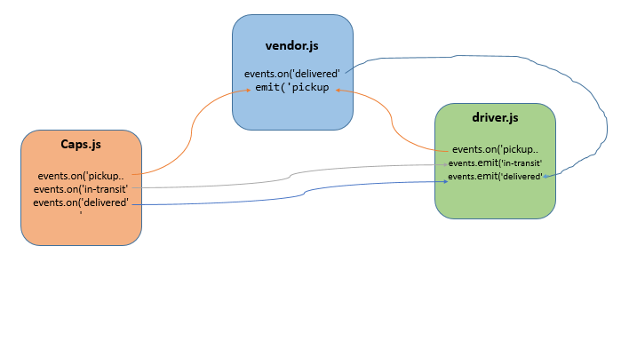
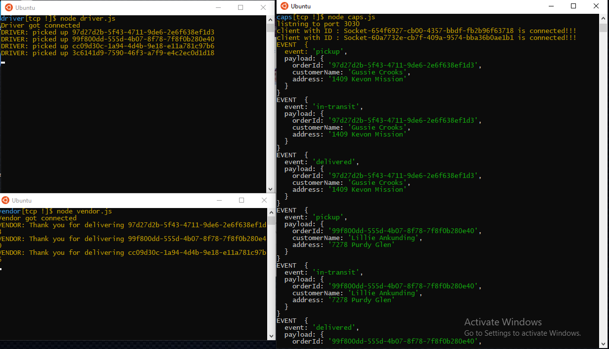

# caps

## Project: Caps

### Author: Israa Othman

### Links and Resources

- [PR lab-16](https://github.com/401-advanced-javascript-israaOthman/caps/pull/2)
- [PR lab-17](https://github.com/401-advanced-javascript-israaOthman/caps/pull/3)
- [PR lab-18](https://github.com/401-advanced-javascript-israaOthman/caps/pull/4)

### Setup

#### `.env` 
   - storeName=rose
   - PORT=3000

#### How to initialize/run your application (where applicable)
- node caps.js
- node driver.js
- node vendor.js

#### UML

